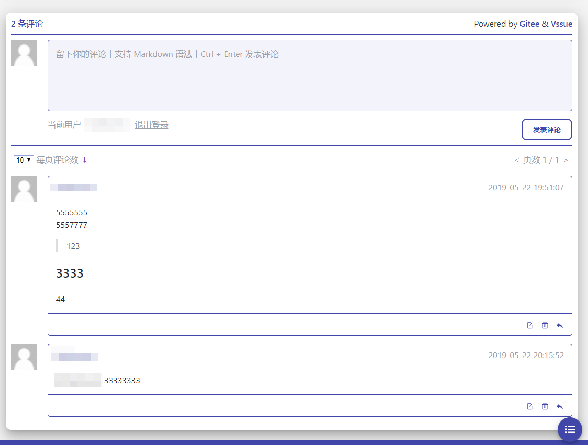

# README

    Vssue API for Gitee



```ts
<script>
  import "imStyles/vssue.styl";
  import { VssueComponent } from "vssue";
  import VssueGiteeAPI from "vssue-api-gitee";

  export default {
    name: "VssueDemo",
    components: {
      Vssue: VssueComponent
    },
    data() {
      return {
        title: "Vssue Demo"
      };
    },
    computed: {
      options() {
        let name;
        if (NODE_ENV === "development") {
          name = "development";
        } else {
          name = "production";
        }
        return Object.assign(
          { api: VssueGiteeAPI },
          this.optionFilter(this.$themeConfig.vssue.option),
          this.optionFilter(this.$themeConfig.vssue[name])
        );
      }
    },
    methods: {
      optionFilter(obj) {
        if (Object.prototype.toString.call(obj).slice(8, -1) !== "Object") {
          return {};
        }
        for (const key in obj) {
          if (obj.hasOwnProperty(key) && !obj[key]) {
            delete obj[key];
          }
        }
        return obj;
      }
    }
  };
</script>
```
